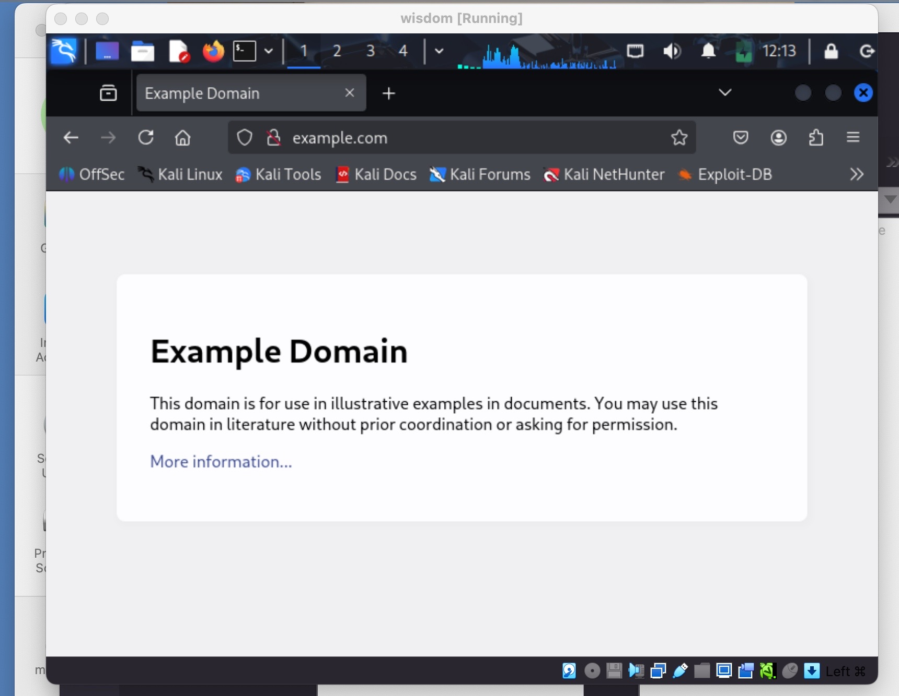
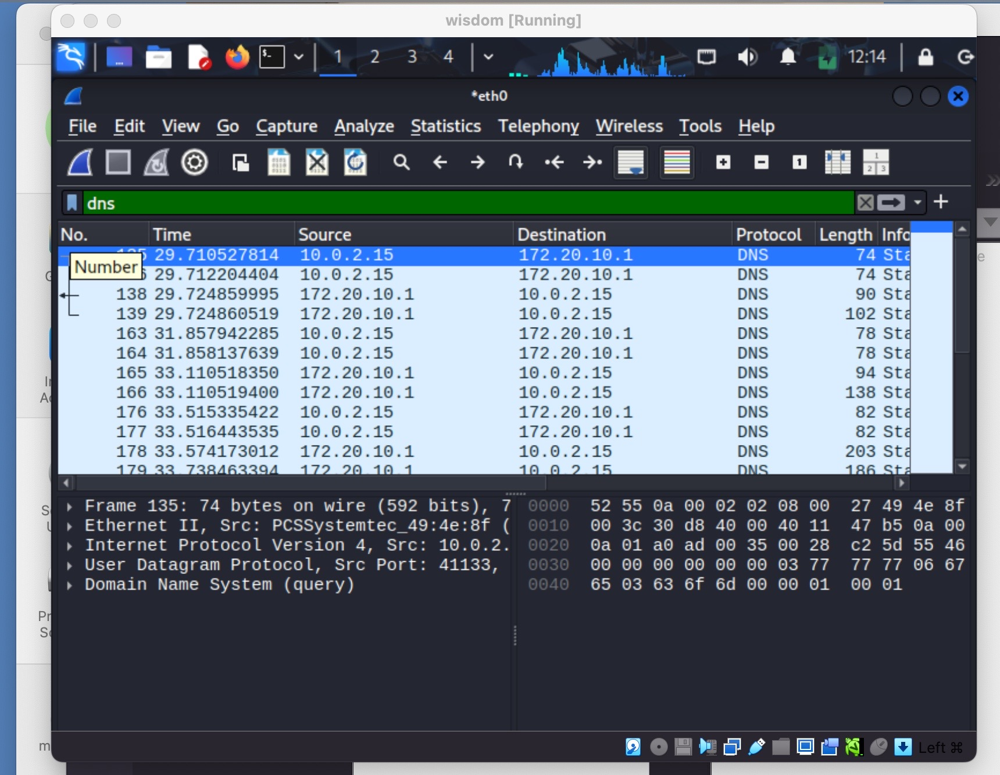
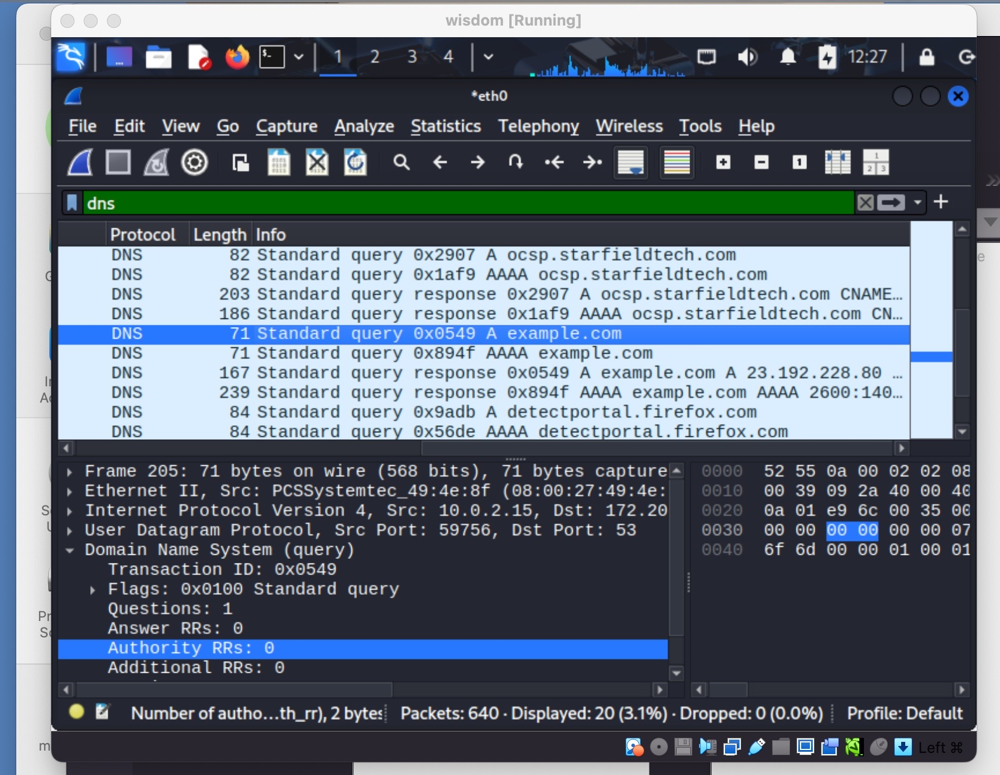
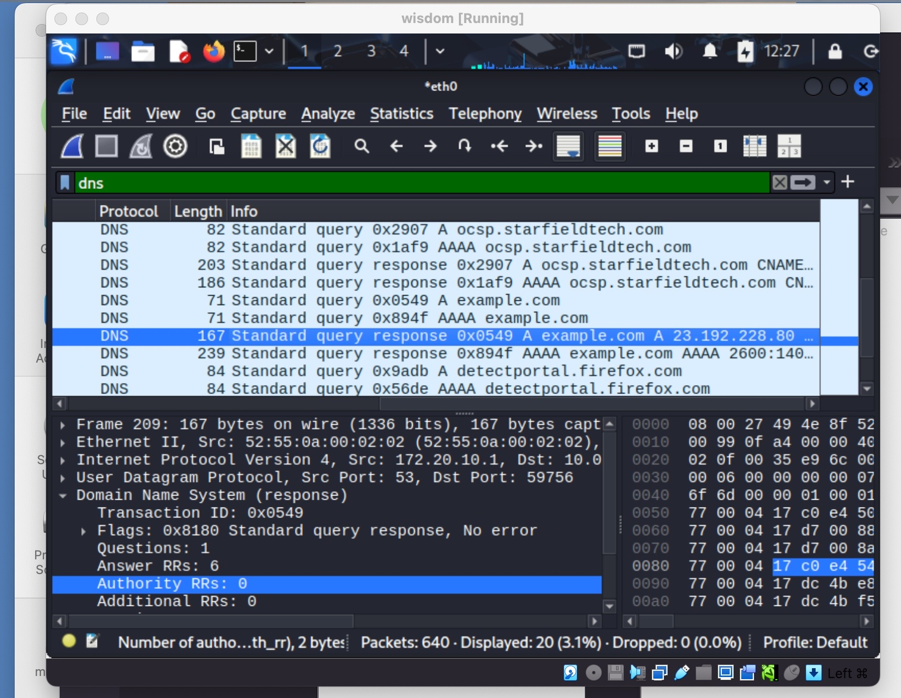

[**<= BACK**](packetsniffing.md)  
# DNS Analysis

## TOOLS USED

Wireshark\
VirtualBox\
Kali Linux

## INTRODUCTION

In this lab, I used Wireshark to capture and analyze DNS traffic.  
The goal was to understand how a client resolves a domain name into an IP address.

## STEPS

### Step 1:
I launched Wireshark on VirtualBox and selected the 'eth0' interface for packet capture.\
\

### Step 2:
I generated DNS traffic by visiting 'http://example.com' in Firefox.\

### Step 3:
I applied the filter 'dns' to only show DNS traffic.\

### Step 4:
I examined a DNS query packet sent by the client.\
Client Request:  
- Transaction ID: 0x0549 
- Flags: Standard query  
- Query: example.com  
- Type: A    

### Step 5:
I examined the DNS response from the server.\
Server Response:  
- Transaction ID: 0x0549   
- Flags: Standard query response, no error  
- Answer: example.com → 23.192.228.80  

## FINDINGS

- DNS translates domain names into IP addresses.  
- Queries and responses can be observed clearly in plaintext.  
- Attackers could spoof DNS responses if no protection (e.g., DNSSEC) is in place.  

## CONCLUSION

This lab demonstrated the basic DNS resolution process using Wireshark.  
I learned how to capture queries, analyze responses, and understand the role of DNS in network communication.
