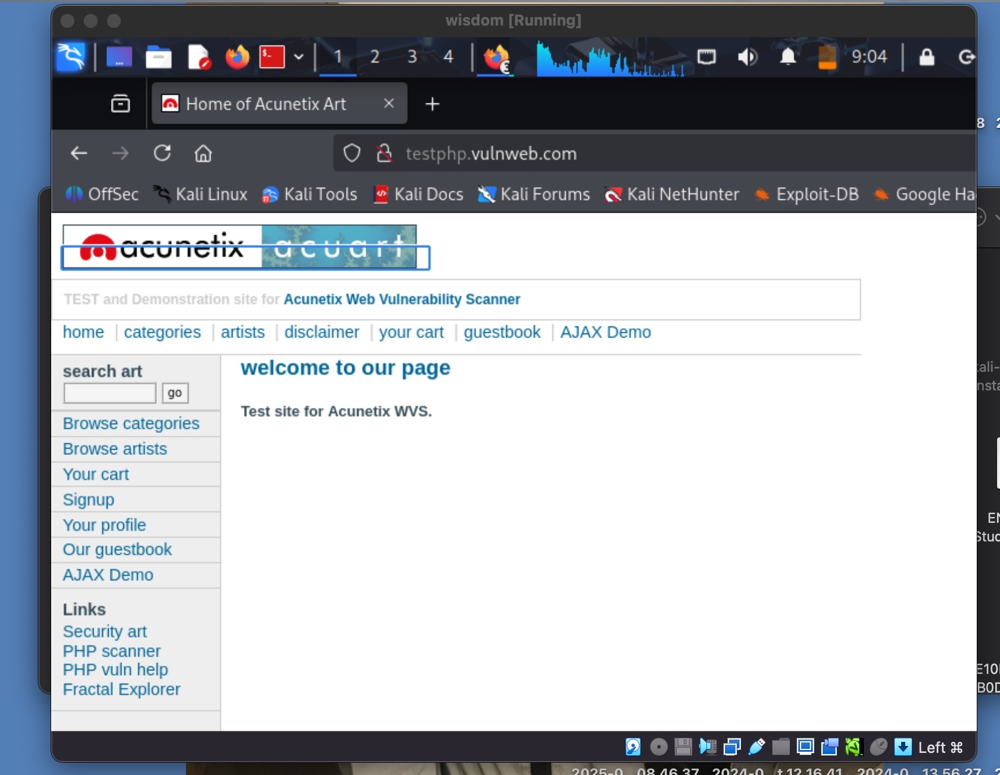
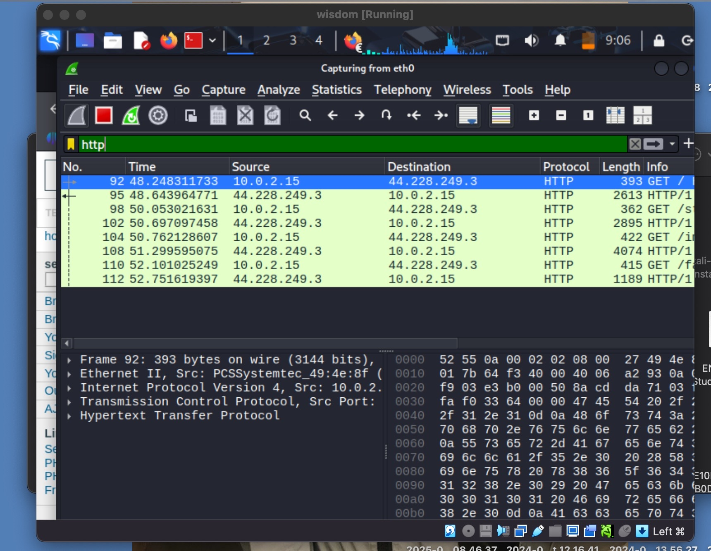
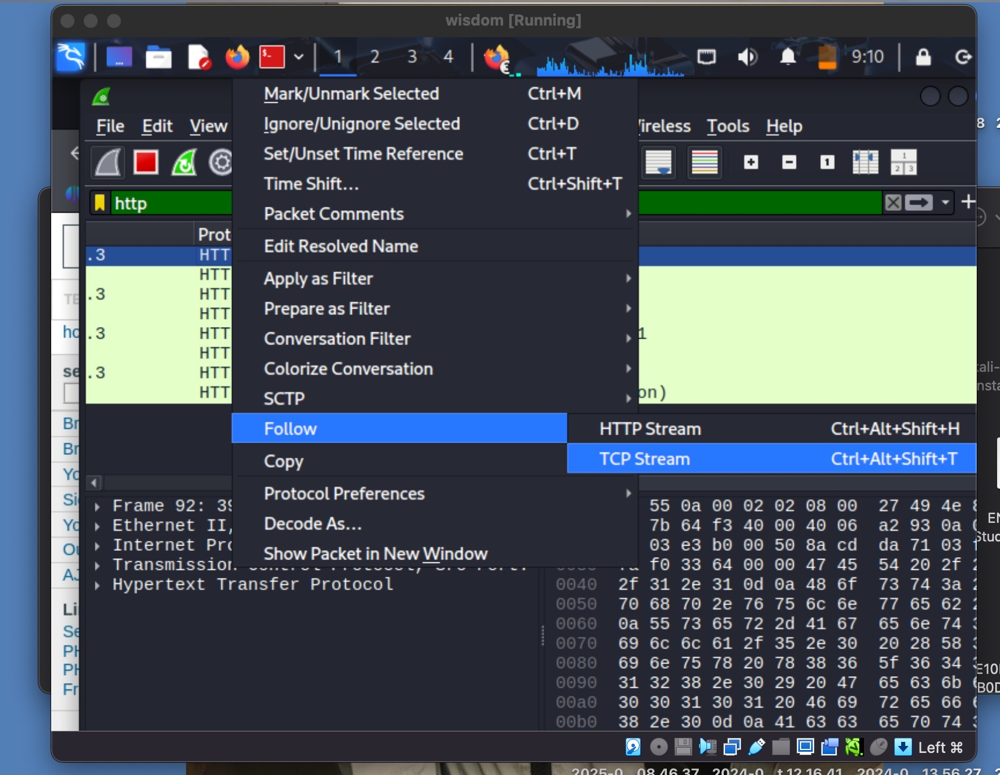
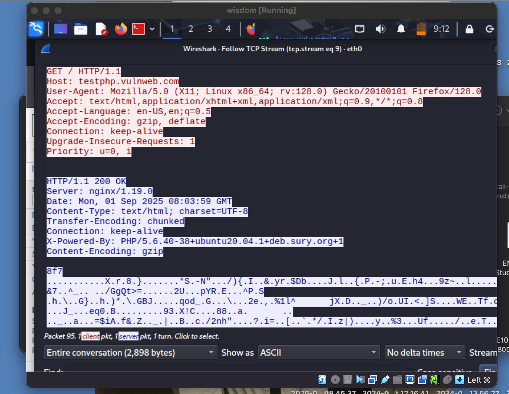

[**<= BACK**](Networking.md)  
# HTTP Analysis

TOOLS USED

Wireshark\
VirtualBox\
Kali Linux

INTRODUCTION

In this lab, I used Wireshark to capture and analyze network traffic. The goal was to identify protocols, inspect packets and detect suspicious activity.

STEPS

Step 1:\
I launched Wireshark on VirtualBox and selected the 'eth0' interface for packet capture.\
\

Step 2:\
I started capturing and generated some HTTP traffic by visiting 'http://testphp.vulnweb.com'.\

Step 3:\
I applied the filter 'HTTP' to only show HTTP traffic.\

Step 4:\
I followed a TCP stream to see the full HTTP request and response.
\
\
Client Request:
- HTTP GET request
- Host: testphp.vulnweb.com
- User-Agent: Firefox 128
- Accept-Encoding: gzip, deflate

Server Response:
- Status: HTTP/1.1 200 OK
- Server: nginx/1.19.0
- Content-Type: text/html; charset=UTF-8
- Transfer-Encoding: chunked
- X-Powered-By: PHP/5.6.40

FINDINGS

- I was able to see HTTP requests in plaintext.  
- Usernames and passwords over HTTP can be intercepted.  
- This demonstrates why HTTPS is critical.

CONCLUSION

Packet sniffing helps analysts understand normal vs. suspicious traffic. This lab showed me how to capture and analyze traffic using Wireshark.
