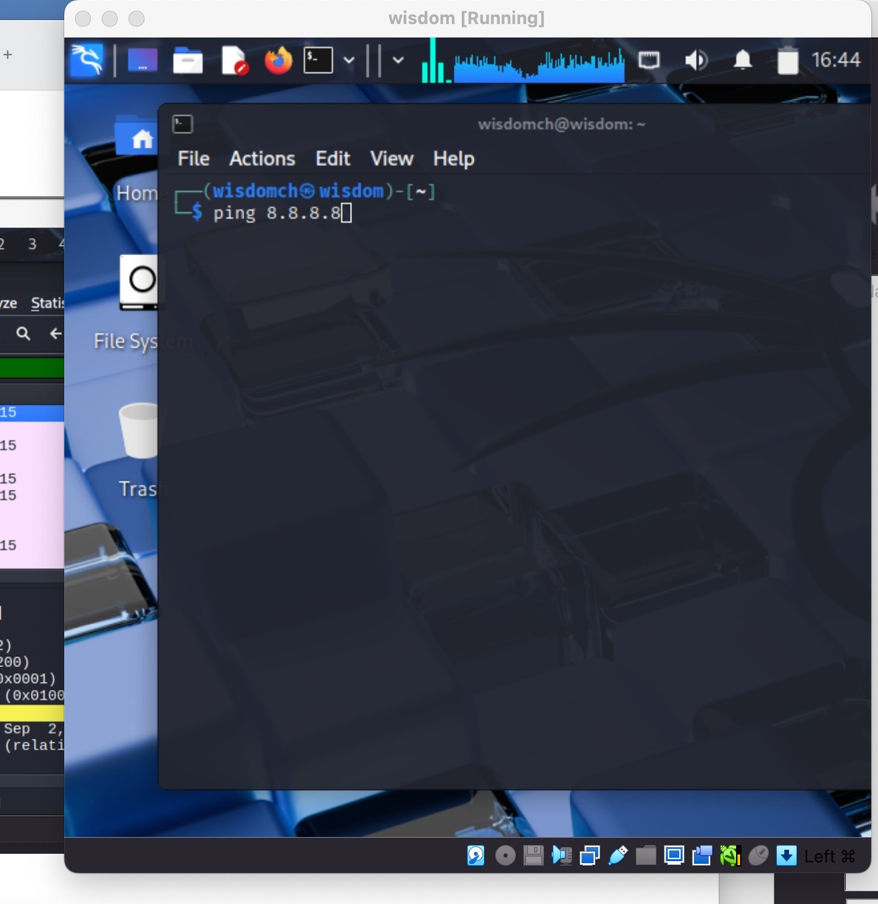
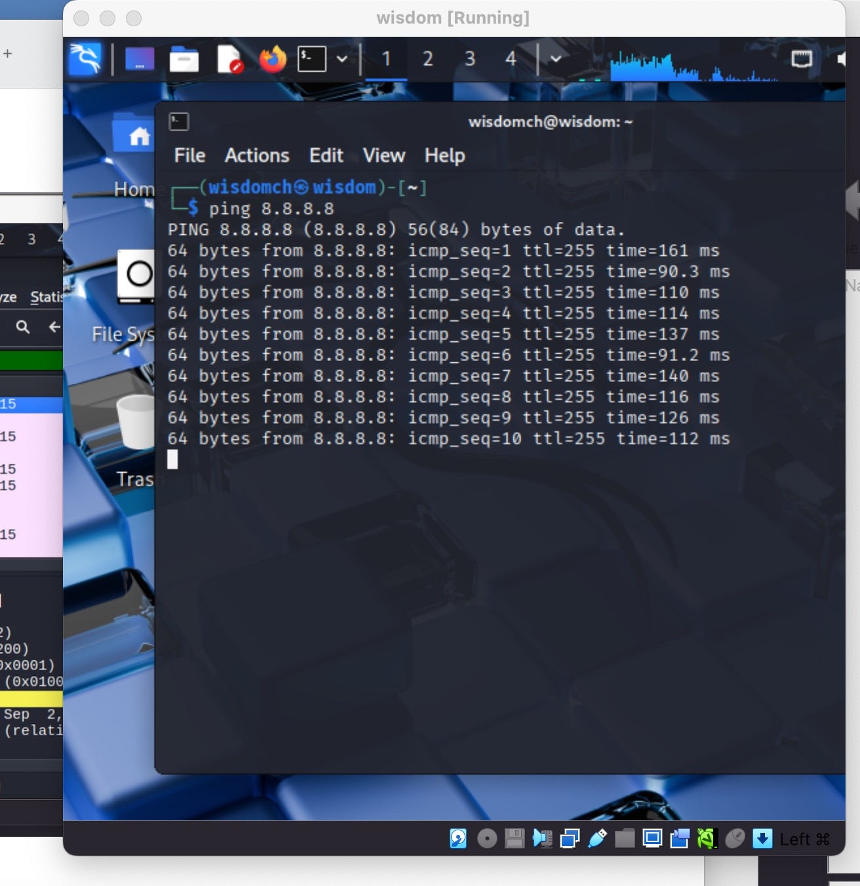
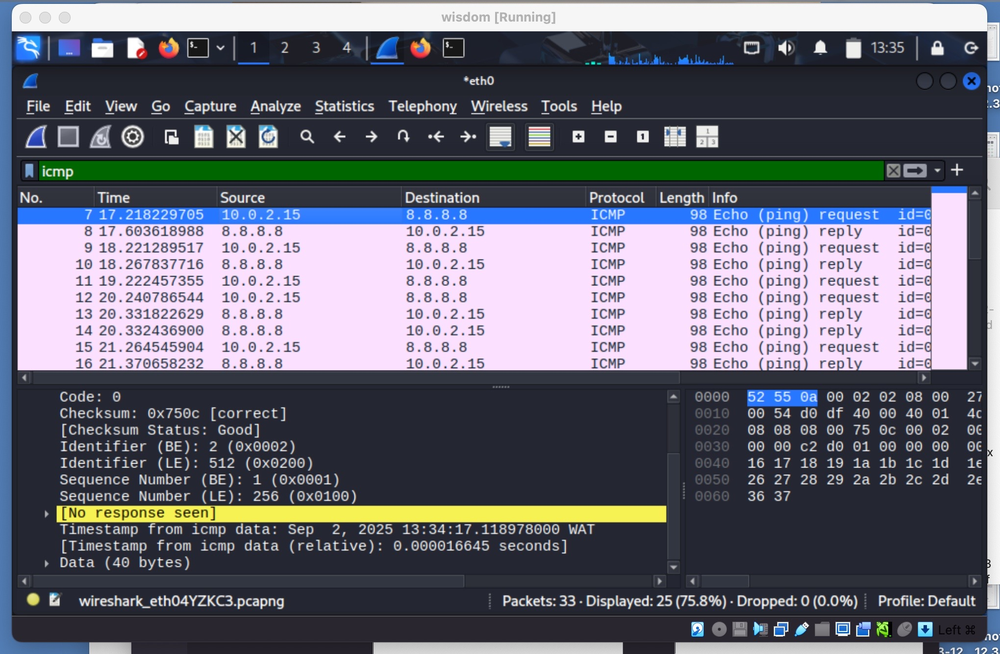
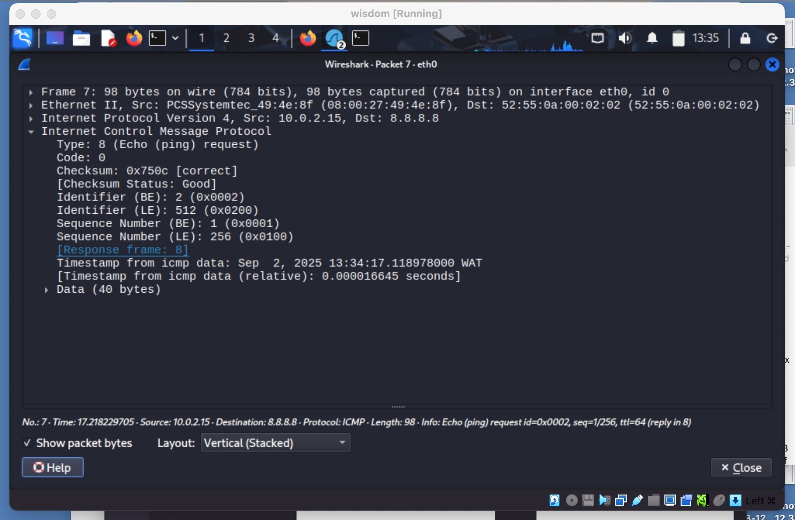
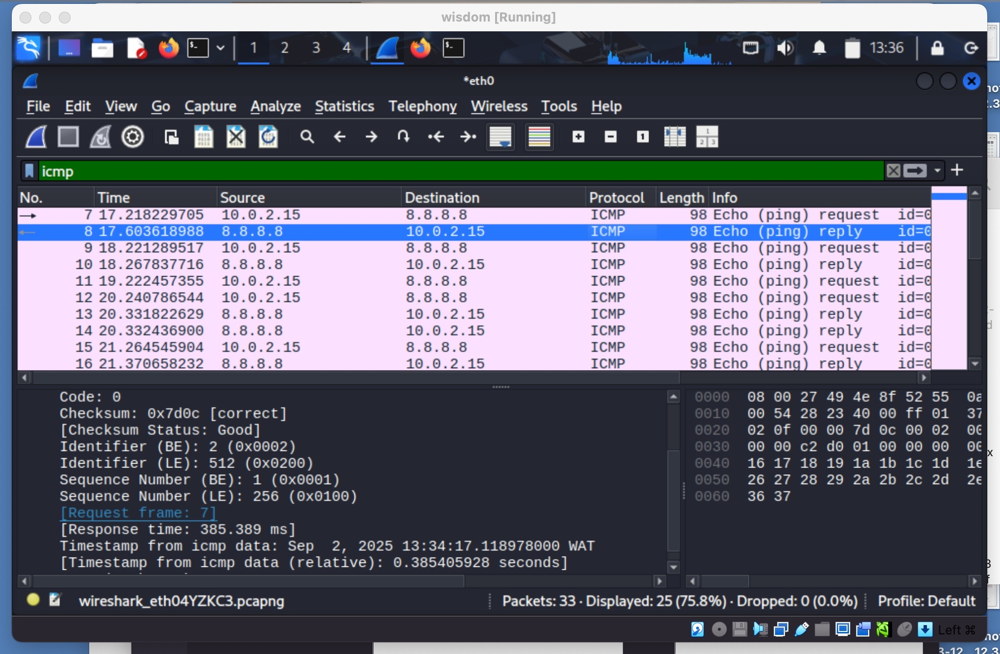
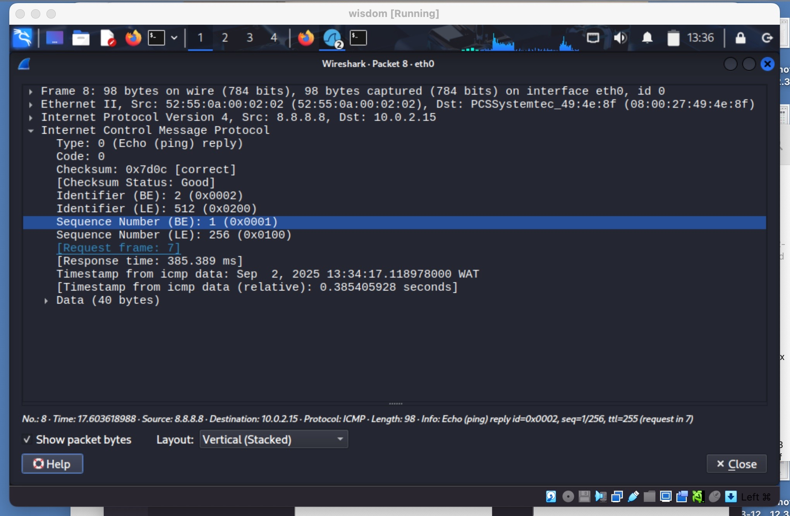

[**<= BACK**](packetsniffing.md)  
# ICMP Analysis

TOOLS USED

Wireshark\
VirtualBox\
Kali Linux

INTRODUCTION

In this lab, I used Wireshark to analyze ICMP traffic generated by the `ping` command.  
ICMP is primarily used for diagnostic and error-reporting purposes, such as testing connectivity and measuring round-trip time between hosts.  

STEPS

Step 1:  
I launched Wireshark on VirtualBox and selected the `eth0` interface for packet capture.  
\

Step 2: 
I generated ICMP traffic by pinging the ip address `8.8.8.8`.  

Step 3:
I applied the filter `icmp` to only show ICMP traffic.

Step 4: ICMP Request and Reply Analysis

Packet 1: ICMP Echo Request 
- Source: 10.0.2.15  
- Destination: 8.8.8.8   
- Type: 8   
- Code: 0  
- Identifier (ID): 0x0002  
- Sequence Number: 1  
- Info: The client is requesting a response to test connectivity.  

Packet 2: ICMP Echo Reply   
- Source: 8.8.8.8 
- Destination: 10.0.2.15   
- Type: 0   
- Code: 0
- Sequence Number: 1  
- Identifier (ID): 0x0002  
- Info: The server replied to confirm connectivity.  

FINDINGS
- ICMP packets are used for connectivity testing and troubleshooting.  
- The Echo Request and Echo Reply process shows successful communication between client and server.  

CONCLUSION
Packet sniffing and ICMP analysis help analysts confirm whether a system is reachable. This lab showed how to capture and analyze ICMP request/reply messages using Wireshark.

