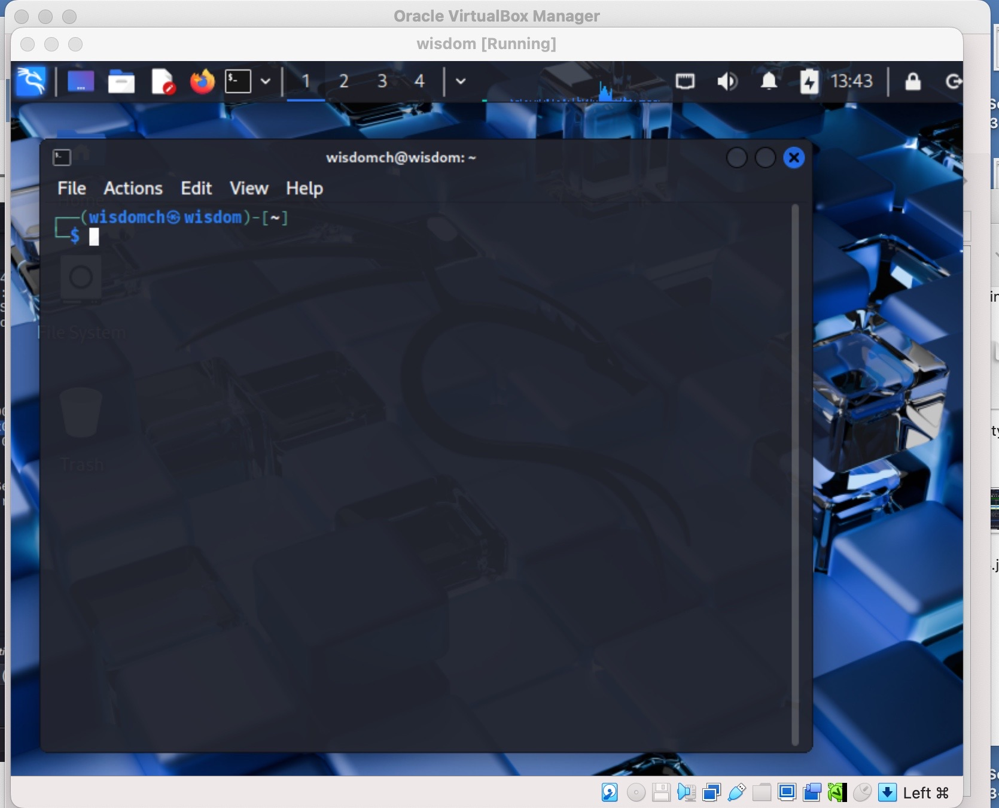
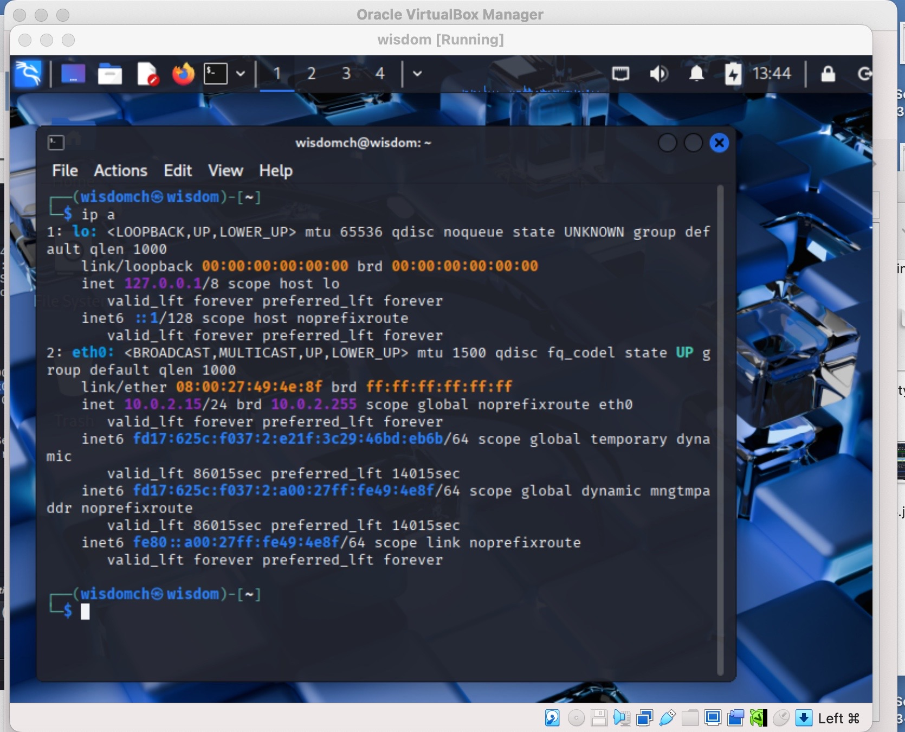
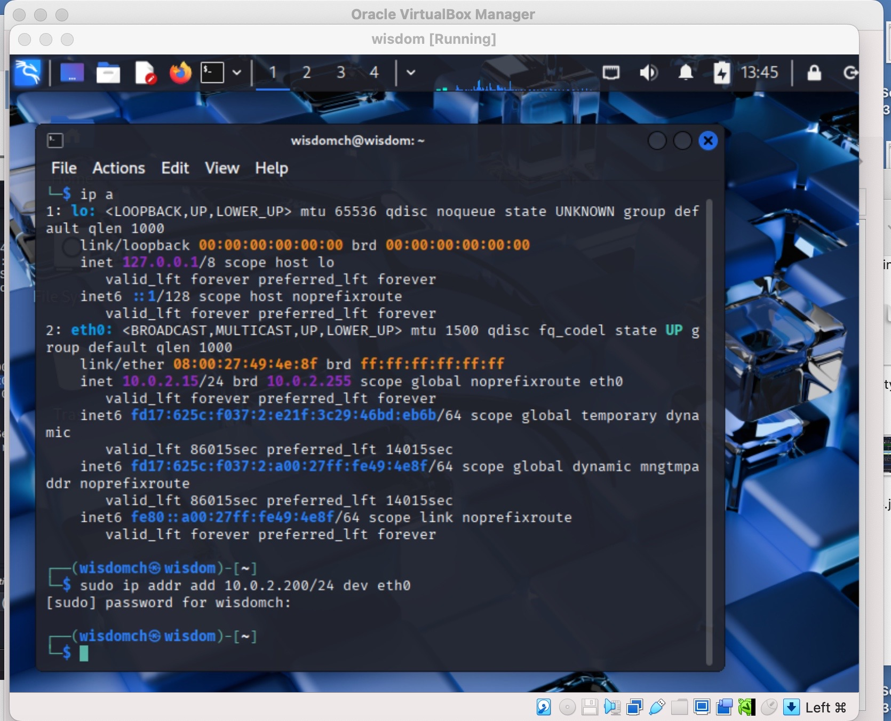
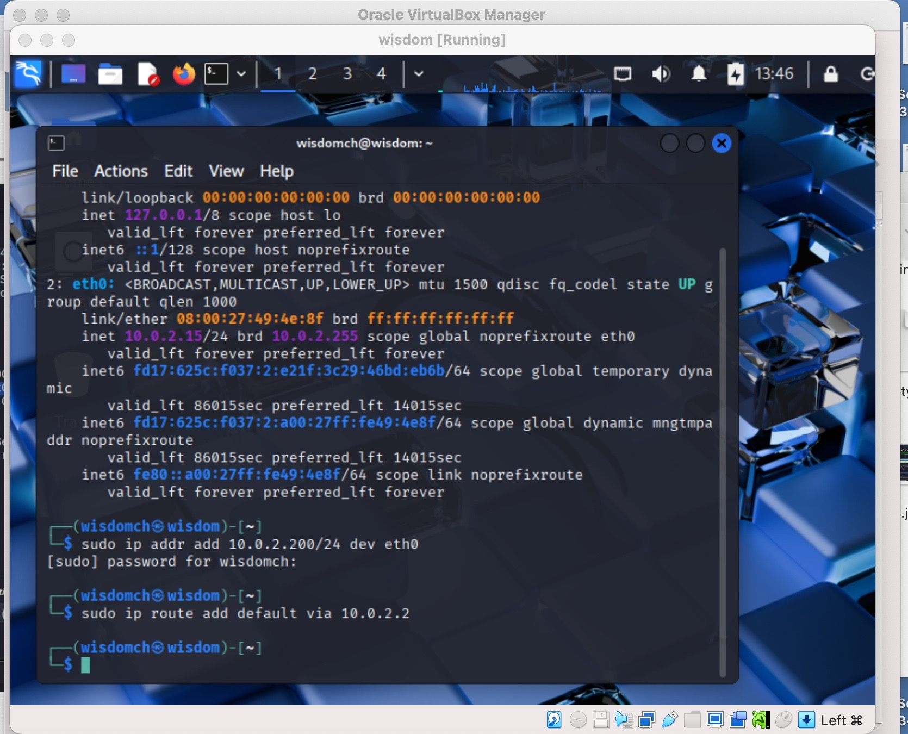
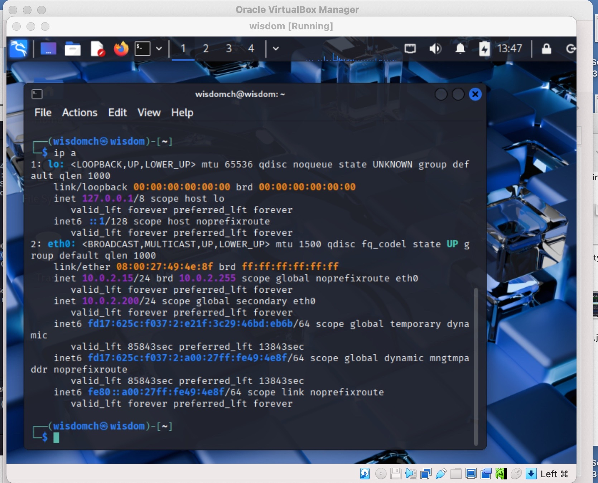

[**<= BACK**](subipconfig.md)  
# Static IP Address Configuration

## TOOLS USED

- VirtualBox  
- Kali Linux  
- Terminal

## INTRODUCTION

In this lab, I practiced how to manually configure a static IP address inside a Linux VM running in VirtualBox. This is an important step for understanding subnetting, IP configuration, and how devices communicate on a network.

## STEPS

### Step 1:
I opened the terminal in my Kali Linux VM and viewed the ip addresses on the `eth0` interface.

### Step 2: 
I assigned the static IP `10.0.2.200/24` to the `eth0` interface using the following command 

### Step 3:
I added the default gateway.

### Step 4:
I verified that the address was successfully applied with the `ip a` command.

## FINDINGS
The interface `eth0` was successfully assigned the static IP `10.0.2.200/24`.
This configuration does not persist after reboot unless added to network configuration files.

## CONCLUSION
By assigning a static IP manually, I learned how to configure network interfaces and verify connectivity using Linux tools. This skill is essential for subnetting, testing, and troubleshooting networks.
