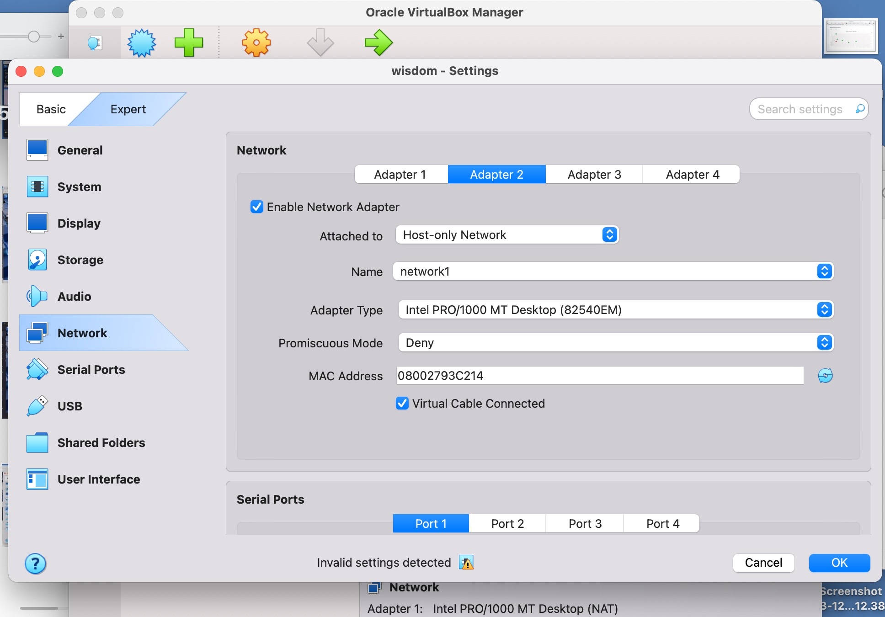

[**<= BACK**](subipconfig.md)  
# Ping and Connectivity Test

## TOOLS USED
- VirtualBox 
- Two Linux VMs 
- Terminal

## INTRODUCTION
This lab demonstrates how IP configuration affects connectivity. Two VMs are placed on the same local area network. First, they are configured in the same subnet. Then one VM is moved to a different subnet without a router.

## STEPS

### Step 1:
1. In VirtualBox, I go to Network and create an internal network called `network1`.

3. For both VMs, i disable the network attached to `NAT` and enable the network only attached to the host:

### Step 2:
I verify the `eth0` interface on both VMs have the new network ip address using the `ip -br a` command.

### Step 3:
I listen for icmp packets on one VM while i use the other VM ping it.

This works perfectly.

### Step 4:
I try pinging another IP address outside the network.

## FINDINGS
- When both VMs share the same subnet `192.168.56.0/24`, they ARP for each other and ping succeeds.
- I try pinging another subnet `192.168.57.0/24` with no router, the VM has no route to reach it, so ping fails.
- Linux will not ARP for off-link destinations. It needs a route/gateway.

## CONCLUSION
Connectivity on the same layer-2 segment requires hosts to share the same IP subnet or have a router between subnets. This lab shows the difference clearly.
