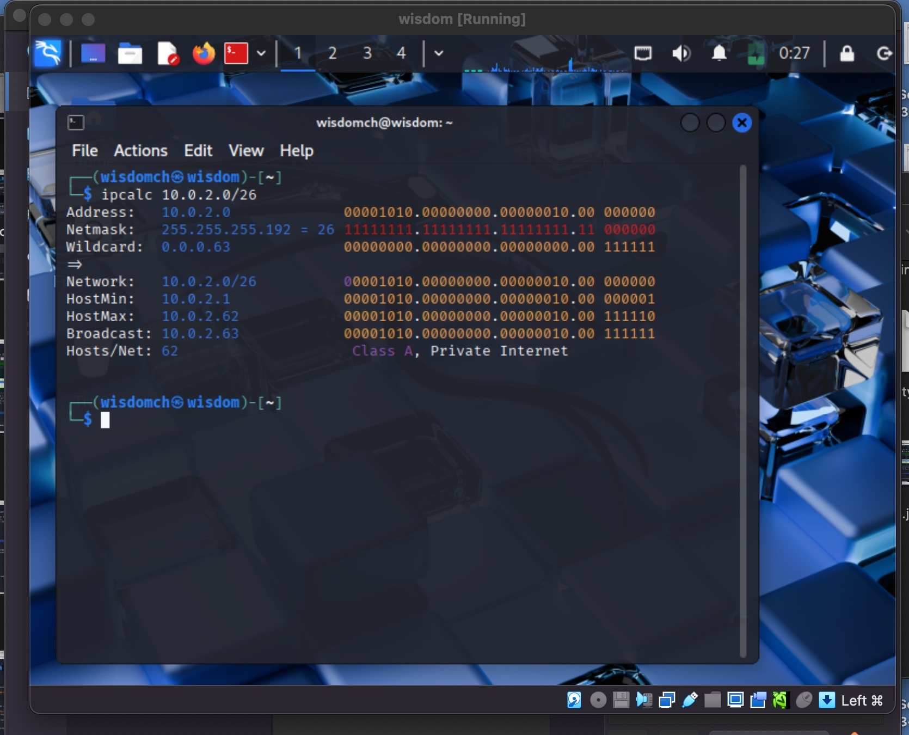
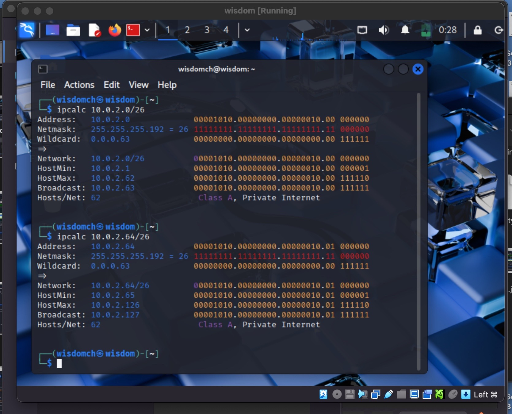
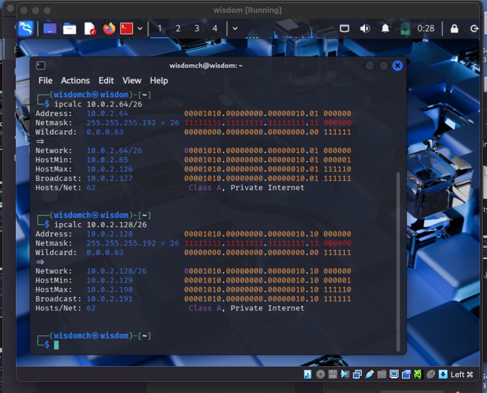
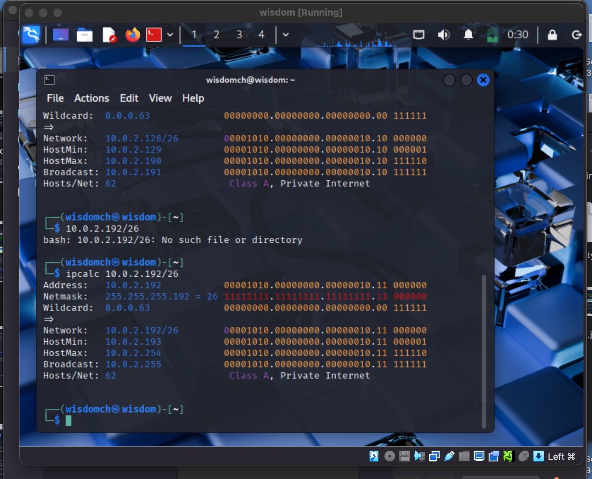

[**<= BACK**](subipconfig.md)  
# Subnetting Calculation 

## TOOLS USED
- Calculator 
- Virtual box / Kali Linux
- Terminal

## INTRODUCTION
In this lab, I practiced subnetting a `/24` network into 4 smaller subnets.  
The goal was to calculate the network address, broadcast address, and usable host range for each subnet, and verify using the `ipcalc` command.

## STEPS

### Step 1:
I started with the network `10.0.2.0/24`.  
A `/24` means 24 bits are used for the network and 8 bits for hosts.  
This gives 256 total addresses.

### Step 2:
To create 4 subnets, I borrowed 2 bits from the host portion.  
- Formula: 2^n = 4(number of subnets)
- `n=2`
- Add `n` to previous prefix. `2` + `/24`. New prefix = `/26`  
- New subnet mask = `255.255.255.192`
- Block size = Hosts / number of subnets
- Block size = `256/4`
- Each subnet has 64 addresses and 62 usable hosts.

### Step 3: Subnet Details

#### Subnet 1: `192.168.1.0/26`
- **Network Address:** 192.168.1.0  
- **Broadcast Address:** 192.168.1.63  
- **Usable Host Range:** 192.168.1.1 – 192.168.1.62  

#### Subnet 2: `192.168.1.64/26`
- **Network Address:** 192.168.1.64  
- **Broadcast Address:** 192.168.1.127  
- **Usable Host Range:** 192.168.1.65 – 192.168.1.126  

#### Subnet 3: `192.168.1.128/26`
- **Network Address:** 192.168.1.128  
- **Broadcast Address:** 192.168.1.191  
- **Usable Host Range:** 192.168.1.129 – 192.168.1.190  

#### Subnet 4: `192.168.1.192/26`
- **Network Address:** 192.168.1.192  
- **Broadcast Address:** 192.168.1.255  
- **Usable Host Range:** 192.168.1.193 – 192.168.1.254  

## FINDINGS
- Borrowing bits from the host portion reduces host capacity but increases the number of networks.  
- A `/24` network with 254 usable hosts can be split into four `/26` networks with 62 usable hosts each.  
- Subnetting ensures efficient use of IP addresses in large networks.

## CONCLUSION
Subnetting is a critical skill for network security engineers and SOC analysts.  
It helps optimize address allocation, improves network performance, and isolates traffic.  
This lab taught me how to manually calculate subnets and verify results using `ipcalc`.
