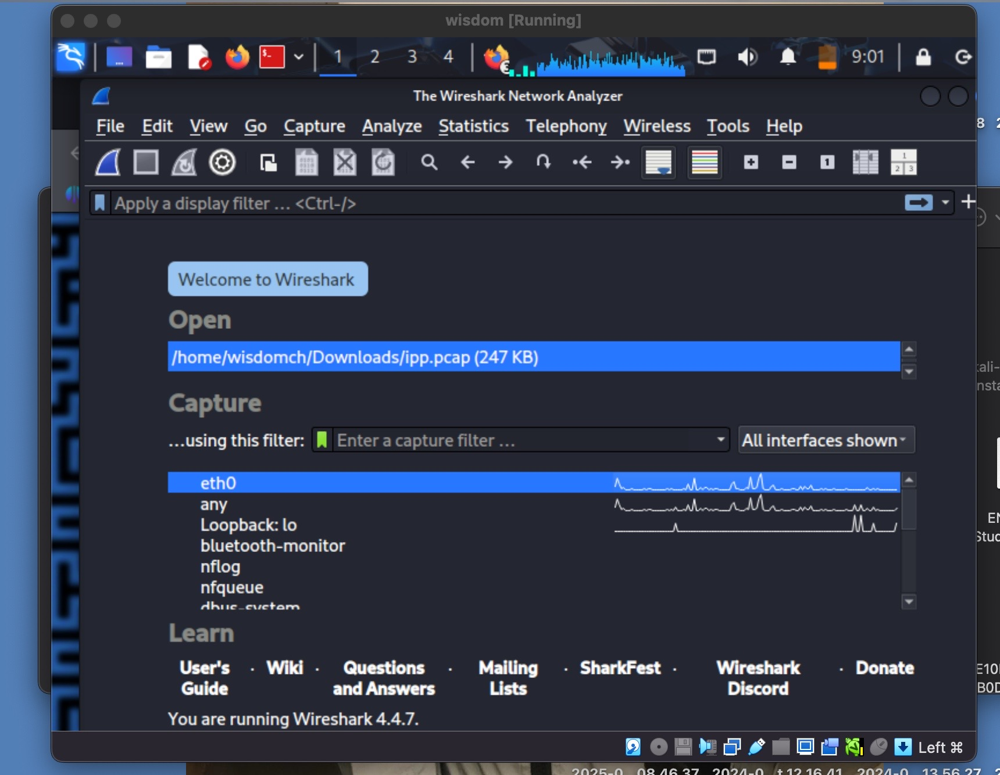
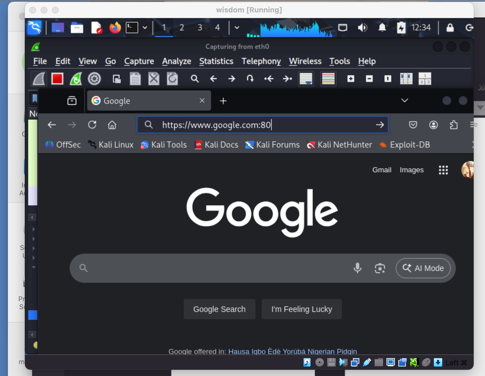
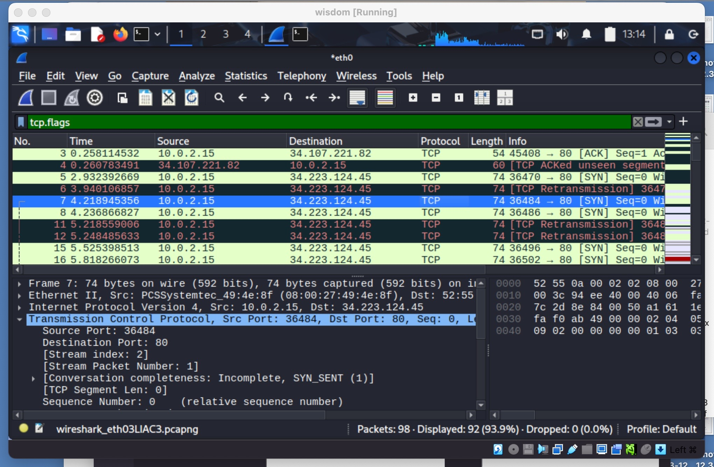
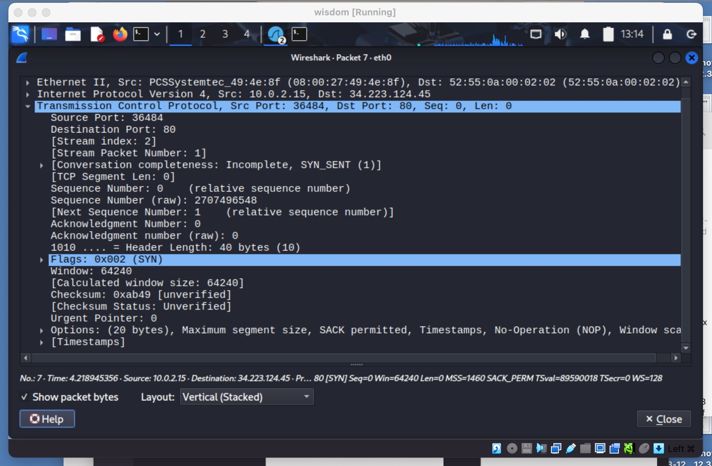
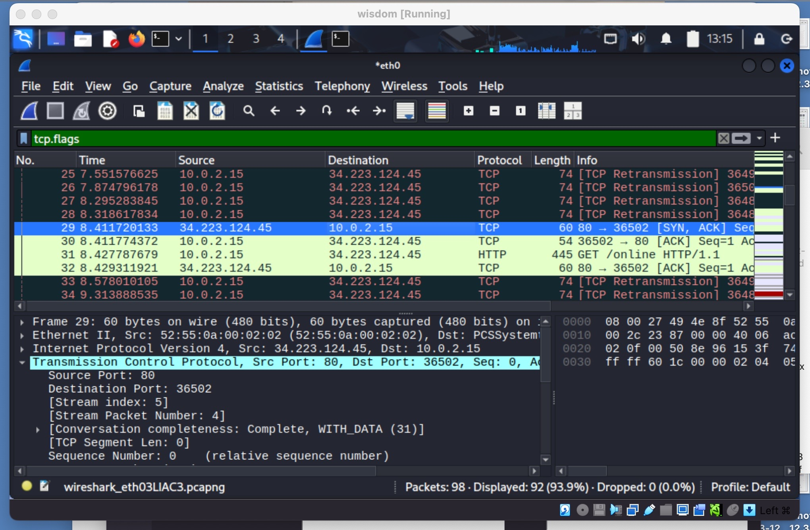
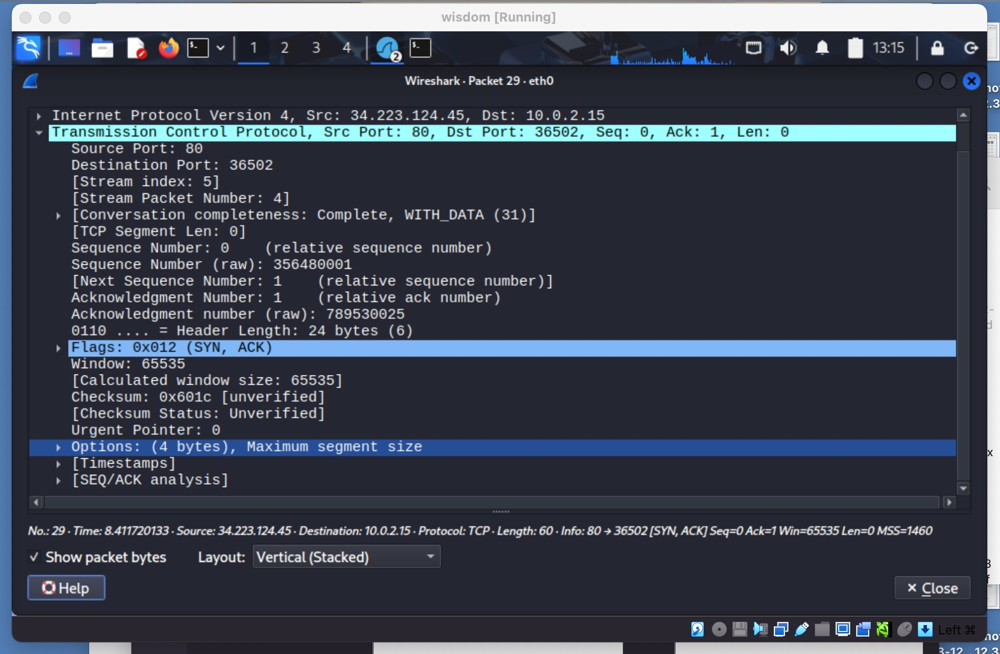
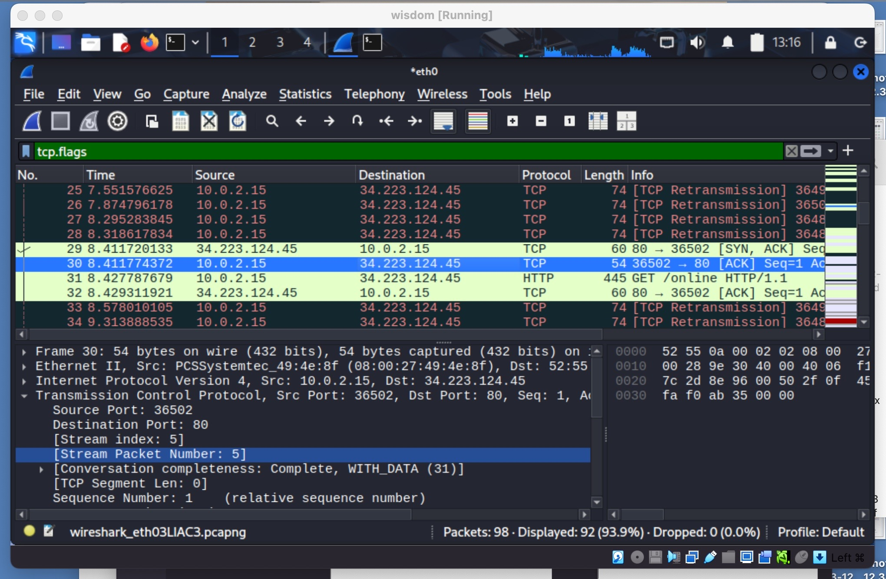
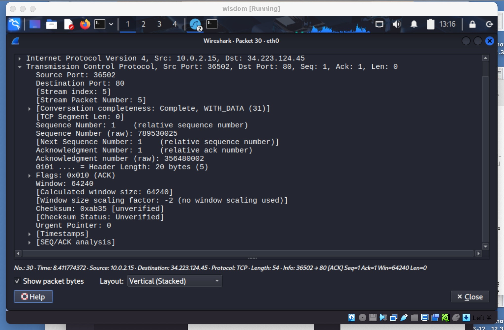

[**<= BACK**](packetsniffing.md)  
# TCP Analysis

TOOLS USED

Wireshark\
VirtualBox\
Kali Linux

INTRODUCTION

In this lab, I used Wireshark to capture and analyze TCP traffic.  
The goal was to observe the TCP three-way handshake.

STEPS

Step 1:\
I launched Wireshark on VirtualBox and selected the `eth0` interface for packet capture.\

Step 2:\
I generated TCP traffic by visiting `google.com:80` in Firefox.\

Step 3:\
I applied the filter `tcp.flags` to only show TCP traffic.\

Step 4: TCP Three-Way Handshake Analysis

- Packet 1: SYN  
  - Source: `10.0.2.15`  
  - Destination: `34.223.124.45`  
  - Flags: SYN  
  - Sequence Number: `0`  
  - Acknowledgment Number: `0`  
  - Info: Client initiates connection and proposes initial sequence number.  
  \
  

- Packet 2: SYN,ACK 
  - Source: `34.223.124.45`  
  - Destination: `10.0.2.15`   
  - Flags: SYN, ACK  
  - Sequence Number: `0`  
  - Acknowledgment Number: `1` 
  - Info: Server acknowledges client’s SYN and responds with its own sequence number.  
  \
  

- Packet 3: ACK
  - Source: `10.0.2.15` 
  - Destination: `34.223.124.45` 
  - Flags: ACK  
  - Sequence Number: `1`  
  - Acknowledgment Number: `1`
  - Info: Client acknowledges server’s SYN. Connection established.  
  \
  

FINDINGS

- TCP uses a reliable connection setup with the three-way handshake.  
- Every packet has sequence and acknowledgment numbers.    

CONCLUSION

This lab demonstrated how TCP establishes a reliable channel between two hosts before data transfer.  
By analyzing the SYN, [SYN,ACK] and ACK packets in detail, I learned how TCP guarantees ordered, error-free communication , which is a fundamental process for almost all modern internet applications.

