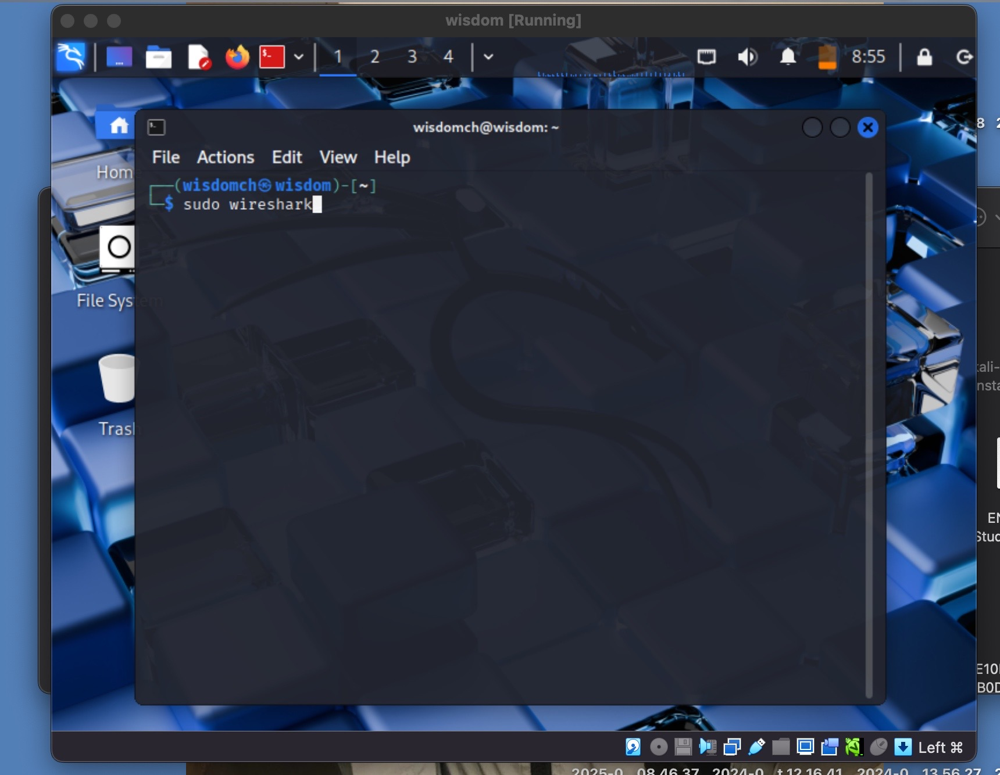
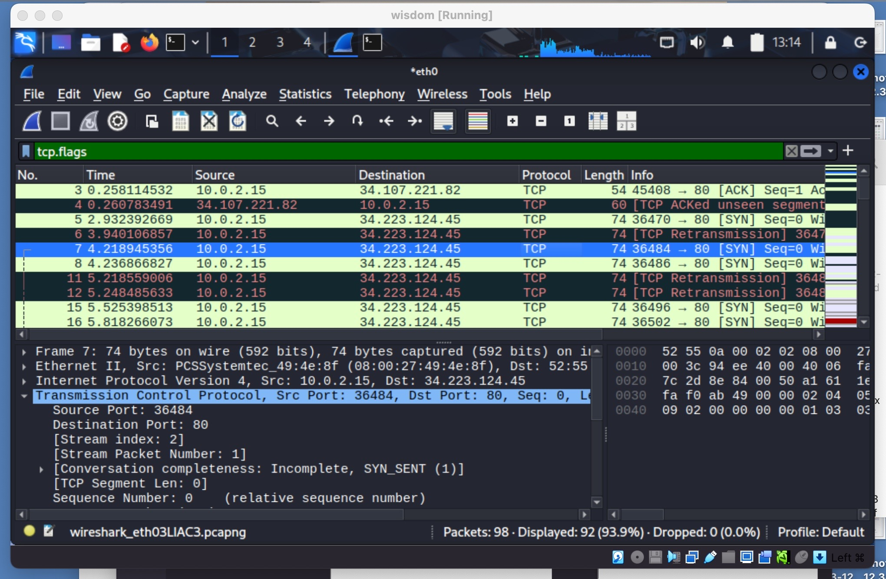
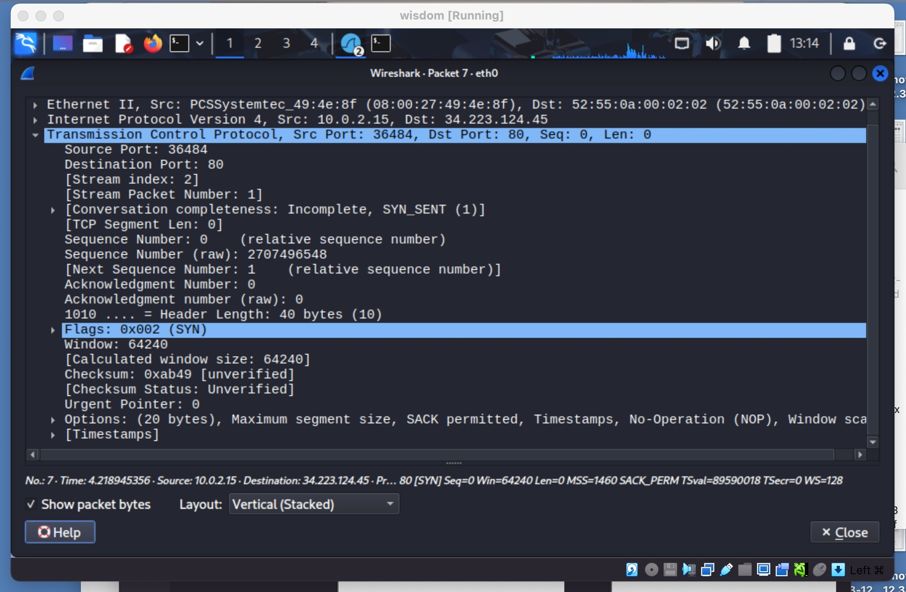

# TCP Analysis

TOOLS USED

Wireshark\
VirtualBox\
Kali Linux

INTRODUCTION

In this lab, I used Wireshark to capture and analyze TCP traffic.  
The goal was to observe the TCP three-way handshake and connection termination.

STEPS

Step 1:\
I launched Wireshark on VirtualBox and selected the `eth0` interface for packet capture.\

Step 2:\
I generated TCP traffic by visiting `google.com:80` in Firefox.\

Step 3:\
I applied the filter `tcp.flags` to only show TCP traffic.\

Step 4:\
I examined the TCP three-way handshake.  
- Packet 1: SYN → Client requests connection  
- Packet 2: SYN-ACK → Server acknowledges and responds  
- Packet 3: ACK → Client acknowledges, connection established  

FINDINGS

- TCP uses a reliable connection setup with the three-way handshake.  
- Every packet has sequence and acknowledgment numbers.    

CONCLUSION

This lab demonstrated how to capture and analyze TCP sessions.  
I learned to identify the handshake, follow sequence numbers, and observe how TCP ensures reliability.

